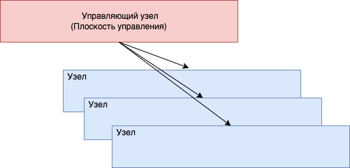
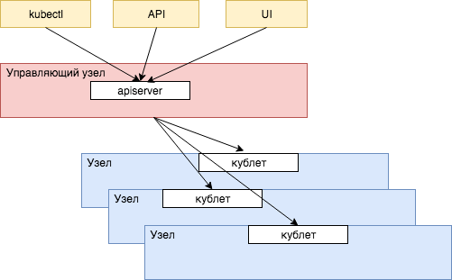
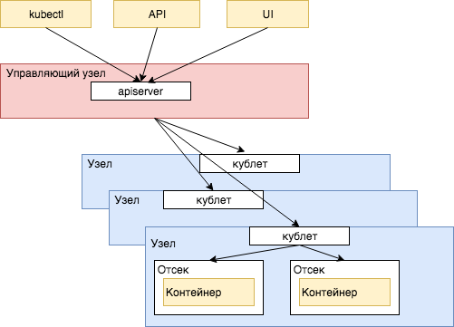

# 5. Первые шаги в Kubernetes

Kubernetes - на данный момент самый гибкий и ставший очень популярным ответ на важнейший вопрос глобальных приложений, способных со временем привлечь миллионы пользователей - как быстро развертывать, обновлять и масштабировать модули и сервисы моего приложения в облаке, эффективно используя всю доступную мне вычислительную мощь? Контейнеры (и их основной инструмент Docker) великолепно справляются с задачей универсальной подготовки и упаковки модулей приложения и сервисов для исполнения на любых серверных версиях Linux. Запуск разнородных приложений становится простой задачей. Остается управлять развертыванием и масштабированием. Неважно, доступен ли вам поначалу лишь один сервер или вообще ваш личный лэптоп, если ваша идея удачна, а реализация хороша, вы привлечете пользователей, и Kubernetes поможет вам развернуть, а затем масштабировать приложение для миллионов практически так же быстро, как если бы им пользовались только несколько человек.

Кстати, о произношении слова - произносится примерно как Кюбэрнэтис, ударение на третий слог. Происхождение слова греческое, κυβερνήτης, управляющий, кормчий корабля, или командир, и между прочим, очень близкое нам - мы заимствовали это слово также и для русского языка - посмотрите на слово губернатор. Заманчиво было бы назвать всю технологию “губернатор”, но это чересчур.

Итак, давайте начнем с азов, терминологии Kubernetes, которая на удивление проста и логична - что без сомнения является одной из причин успеха всей технологии. Ваше приложение будет работать в кластере (cluster) - группе однородных вычислительных ресурсов, если говорить в общих терминах. В большинстве случаев это стойка с Linux/UNIX-серверами одного типа (server rack). В других случаях это может быть набор специализированных ресурсов, например основанных на чипах GPU (графических процессоров, особенно подходящих для специализированных вычислений - как здесь не вспомнить волну популярности криптовалют или машинного обучения). В любом случае каждому из этих ресурсов надо выделить свою часть работы и запустить ее.

Элемент кластера, то есть сервер Linux или похожий на него ресурс, будет называться узлом (node, cluster node). Раньше этот узел часто называли подчиненным или ведомым (slave), но в Kubernetes намеренно от этого отказались, так как звучать подобное название может не слишком приятно.

Главный пункт управления всеми процессами и масштабированием находится в управляющем узле (master node).




Управляющий узел Kubernetes и будет заведовать распределением задач по доступным ему вычислительным ресурсам подчиненных узлов и держать с ними связь. Коммуникацией между управляющим и остальными узлами заведует небольшой процесс, работающий на каждом узле - кублет (kubelet, формально можно перевести как мини-управляющий. Мы привыкли подобные слова использовать без перевода - сервлет как мини-сервер, апплет как мини-приложение).

Сам управляющий узел будет получать команды и задачи уже от нас, с помощью предоставляемого им интерфейса API, работающего в процессе под довольно очевидным названием apiserver. Существует множество способов общения с управляющим узлом кластера Kubernetes - самый известный это через командную строку с помощью команды kubectl (Произносится как кюб-контрол. Часто произносят просто буквы английского алфавита, кюб-си-ти-эл), через множество вариантов пользовательских интерфейсов (UI), ну и наконец непосредственно вызывая сам сервер через его точки доступа. Команды обычно передаются в формате JSON и YAML.





Как мы теперь хорошо знаем, запускать и настраивать множество разнородных приложений на одном физическом сервере (или одной виртуальной операционной системе) непросто, и это часто приводит к путанице и ошибкам с версиями, путями, библиотеками и инструментами. Все это блестяще решают контейнеры. Нетрудно догадаться, что вместо того чтобы запускать на своих вычислительных узлах процессы или установку напрямую, в мире Kubernetes все работает исключительно в контейнерах.

Все ваши сервисы, микро или чуть больше, или непосредственно приложения, будут работать в контейнерах, размещенных в узлах кластера. Как правило контейнеры будут работать под управлением Docker, но Kubernetes поддерживает и другую систему управления под названием rkt.

Есть только одно важное отличие - контейнеры будут работать не в самом узле, а в своем небольшом пространстве, называемом отсеком (pod). В отсеке могут выполняться несколько контейнеров одновременно. Контейнеры внутри отсека имеют более тесную связь и главное, разделяют пространство своих процессов, память и тома с данными, имеют одинаковый IP адрес, а также могут связываться через локальный адрес localhost. Отсеки узла разделены друг от друга также хорошо как и обычные контейнеры. Можно сразу сказать, что обычно на один отсек приходится один контейнер, и только в некоторых случаях к основному контейнеру с главным сервисом или приложением присоединяют вспомогательный - например для отправки журналов (logs), или настройки сети.




## Первые выводы
* Kubernetes работает с кластером - группой серверов или похожих вычислительных ресурсов, с помощью которых он будет исполнять ваши сервисы или приложения.
* Главная единица сервиса или приложения, которая будет исполняться на кластере - это образ (image) контейнера, в котором содержится полное описание приложения, его зависимости, инструменты и библиотеки, открытые порты и требуемое хранилище, а также команды, необходимые для запуска. Кроме этого образа, Kubernetes ничего не знает про приложение.
* Контейнеры запускаются на узлах кластерах в отдельных пространствах, называемых отсеками.
* Один из узлов в кластере является управляющим и управляет запуском и масштабированием контейнеров на всех остальных узлах.
* На каждом узле кластера установлен агент Kubernetes, так называемый кублет. Он получает команды от управляющего узла и запускает, останавливает и проверяет состояние отсеков с контейнерами. Только узлы, на которых работает кублет, доступны для управления Kubernetes.
* Наконец, сам управляющий узел получает команды от вас - с помощью командной строки и команды kubectl, или через разнообразные варианты пользовательских интерфейсов, созданных для управления Kubernetes. Командой как правило является развертывание образа вашего контейнера, с описанием его точек доступа и желаемым уровнем и способом масштабирования - например, автоматическим в зависимости от загрузки или сразу с определенным количеством работающим экземпляров на разных узлах и отсеках.

## Первое развертывание

Пока все достаточно очевидно и логично - Kubernetes это система развертывания и масштабирования, которая запускает ваши сервисы и приложения из образов, в которые они упакованы, развертывает и запускает их по всему пространству ресурсов, доступных в кластере, и далее следит за работающими экземплярами. Часто говорят, что подобная система занимается оркестровкой контейнеров (orchestration).

Особенно удобно это становится когда речь идет о приложениях, работающих в облаках и предоставляемых ими кластерах. В своем собственном физическом кластере, который вам полностью принадлежит, вы можете опробовать разные способы развертывания и управления своими сервисами и приложениями, экспериментировать с серверами и их настройками, но на общих, разделенных вычислительных ресурсах облака, к которым у вас весьма ограничен доступ, общая система управления Kubernetes особенно хороша.

Первое, что нам понадобится для работы с любыми ресурсами и API Kubernetes - интерпретатор команд Kubernetes `kubectl`. Часто он устанавливается вместе с пакетами для разработки программ самых распространенных провайдеров публичных облаков Google, Amazon или Microsoft, но если вы только начинаете, работаете с локальным кластером, или предпочитаете сразу установить `kubectl` на своем собственном компьютере самостоятельно, зайдите за инструкциями по установке на официальный сайт Kubernetes `kubernetes.io`. Установка с помощью менеджера пакетов вашей операционной системы или с помощью прямого вызова командой `curl` не должна вызвать у вас особенных затруднений.

Далее нам нужен будет непосредственно кластер Kubernetes, то есть набор вычислительных ресурсов единого типа, с установленным на ними управлением Kubernetes, что, как мы уже успели увидеть, будет включать в себя кублеты, управляющий узел, и разнообразные API. 

Самый простой вариант на данный момент - предоставляемый Docker минимальный кластер Kubernetes для экспериментов и тестирования. Как правило вы уже работаете с инструментом Docker для построения и управления контейнерами на своей машине. Если эта машина не Linux (Mac или Windows), это означает, что за кулисами Docker уже запустил минимальную виртуальную машину Linux для поддержки контейнеров. Новые версии Docker могут запустить на этой же виртуальной машине кластер Kubernetes, состоящий из одного узла.

Второй распространенный и доступный вариант - попробовать установить локальный эмулятор Kubernetes под названием `minikube` на свой собственный сервер или рабочую машину. `minikube` поддерживает все популярные операционные системы. Для этого пригодится открытый проект на Github `kubernetes/minikube`, там же (а также на сайте книги `www.ipsoftware.ru`) вы найдете подробные инструкции об установке. Установка будет чуть сложнее чем для `kubectl`, придется еще выбрать драйвер виртуализации для запуска и поддержки виртуальной машины, на которой будет запущен ваш локальный узел Kubernetes. 

Итак, будем считать, что с первоначальной настройкой кластера мы быстро разобрались, и теперь можно получить первую информацию о структуре нашего кластера с помощью команд `kubectl config current-context` (получит название контекста `kubectl`, то есть набора адресов, управляющего узла, и остальных данных о текущем кластере), `kubectl cluster-info` (сетевые адреса управляющего кластера) и `kubectl get nodes` (узлы кластера).

Вот что мы получим для кластера `minikube`:

```shell
$ kubectl config current-context
minikube
$ kubectl cluster-info
Kubernetes master is running at https://192.168.64.3:8443
KubeDNS is running at
https://192.168.64.3:8443/api/v1/namespaces/kube-system/services/kube-dns:dns/proxy
$ kubectl get nodes
NAME       STATUS    ROLES     AGE       VERSION
minikube   Ready     master    6d        v1.10.0
```

Как легко увидеть, по умолчанию `minikube` запускает единственный узел - он будет и управляющим, и использоваться для размещения всех развертываний, что конечно, неоптимально, но вполне подходит для локального тестирования и отладки. 

Если вы используете в качестве кластера виртуальную машину Docker, получится примерно следующее:

```shell
$ kubectl config current-context
docker-for-desktop
$ kubectl cluster-info
Kubernetes master is running at https://localhost:6443
KubeDNS is running at
https://localhost:6443/api/v1/namespaces/kube-system/services/kube-dns:dns/proxy
$ kubectl get nodes
NAME                 STATUS    ROLES     AGE       VERSION
docker-for-desktop   Ready     master    10m       v1.10.3
```

Здесь все похоже на `minikube`, но естественно другое название для контекста `kubectl` и как видно, Docker использует адрес `localhost` вместо виртуального сетевого адреса, но суть примерно такая же, и по умолчанию под управлением Kubernetes в кластере имеется только один узел.

Если вы создадите кластер в настоящем облаке, например Google Cloud, назовете проект для него `hello-cluster`, и для начала будете использовать три узла, получится следующая картина:

```shell
$ kubectl get nodes
NAME                                           STATUS    ROLES     AGE       VERSION
gke-hello-cluster-default-pool-b36cb657-hw5j   Ready     <none>    20h       v1.8.7-gke.1
gke-hello-cluster-default-pool-b36cb657-qwff   Ready     <none>    20h       v1.8.7-gke.1
gke-hello-cluster-default-pool-b36cb657-r4z2   Ready     <none>    20h       v1.8.7-gke.1

```

Как видно, в нашем кластере три рабочих узла, все они содержат название самого кластера (`hello-cluster`) как часть своего имени. Вы получите примерно такой же результат в своей консоли.

В качестве сервиса, который мы будет развертывать и масштабировать на нашем кластере, возьмем микросервис (скорее даже наносервис в нашем случае, но это простой пример), сообщающий текущее время.

Напишем его на Go:

```go
package main

import (
	"encoding/json"
	"log"
	"net/http"
	"strconv"
	"time"
)

type Time struct {
	Time     string `json:"time,omitempty"`
	NanoTime string `json:"nanoTime,omitempty"`
}

func main() {
	log.Print("Начало работы сервиса time-service")

	http.HandleFunc("/time", serveTime)
	http.HandleFunc("/nanotime", serveNanoTime)
	log.Fatal(http.ListenAndServe("0.0.0.0:8080", nil))
}

func serveTime(w http.ResponseWriter, r *http.Request) {
	log.Print("Вызов функции serveTime()")
	var serverTime Time
	serverTime.Time = time.Now().String()
	json.NewEncoder(w).Encode(serverTime)
}

func serveNanoTime(w http.ResponseWriter, r *http.Request) {
	log.Print("Вызов функции serveNanoTime()")
	var nanoTime Time
	nanoTime.NanoTime = strconv.FormatInt(time.Now().UnixNano(), 10)
	json.NewEncoder(w).Encode(nanoTime)
}
```

Как видно, мы создаем две точки доступа к нашему сервису - он способен сообщать время как в формате строки (формат выбран в реализации Go по умолчанию и довольно подробен), или в виде числа наносекунд стандартного времени эпохи Unix, в стандартной библиотеке Go это время возвращает функция `UnixNano()`. Для HTTP сервера Go, который будет работать в контейнере, предпочтительнее указать общий адрес для всех локальных сетевых интерфейсов `0.0.0.0` напрямую, но это малозначительная особенность, которая во многих случаях или в других средах запуска контейнеров может быть и не нужна, но и вредной не будет.

Результат сервис будет возвращать в виде JSON, поддержка этого формата реализована в Go в стандартном пакете `encoding/json`. Для простоты реализации оба варианта получения времени используют в качестве возвращаемого значения одну и ту же структуру `Time`, но любое неиспользуемое поле не будет записываться в JSON - это позволит сделать дополнительная аннотация `omitempty`.

Мы также используем стандартное решение Go для записи журналов (logs) доступа к нашему сервису - пакет `log`. Без дополнительной настройки журналы будут записываться в стандартный вывод приложения, и как мы увидим чуть позже, это именно то, что нужно для сбора журналов в Kubernetes.

Далее мы создадим файл сборки образа контейнера Dockerfile:

```
# Собирает образ для контейнера с сервисом получения времени.
FROM golang:1.9

WORKDIR /opt/go/time-service

EXPOSE 8080
COPY *.go .

RUN go build

ENTRYPOINT [ "/opt/go/time-service/time-service" ]
```

Здесь все совсем просто, благодаря отличной поддержке языка и среды Go среди стандартных образов открытого репозитория Docker. Нам нужно лишь выбрать версию Go - мы берем последний большой выпуск 1.9, используем порт 8080, и копируем наш файл в образ. Директорию мы выбираем с тем же именем, с которым этот файл лежит у нас в Github в репозитории с примерами книги, и именно это имя мы будем использовать как имя образа. Название директории также будет использовано по умолчанию компилятором Go в качестве имени скомпилированного файла. Остается скомпилировать сервис и указать Docker, что при запуске экземпляра контейнера мы запускаем наш сервис, с помощью команды `ENTRYPOINT`.

Нам остается собрать наш образ, указав его метку для последующего хранения в открытом репозитории Docker Hub или любом другом репозитории, и наш сервис готов к развертыванию и запуску.

```shell
docker build . -t {ваша_учетная_запись_Docker}/time-service
```

Протестируем наш образ и сервис обычным образом на локальной машине и убедимся что все собрано и настроено верно:

```shell
docker run -d -p 8080:8080 {ваша_учетная_запись_Docker}/time-service
curl localhost:8080/nanotime
curl localhost:8080/time
```

Запустив `curl`, вы увидите что именно вам отвечает сервис. Если что-то не срабатывает, дело как правило в настройках сетевых портов между локальной машиной и контейнером. Не забудьте остановить запущенный контейнер (`docker stop`) после того, как закончите свои тесты.

Теперь наступает самое интересное - развернем наш сервис на новом кластере.
Чтобы управляющая среда Kubernetes понимала, откуда ей нужно взять образ контейнера с нашим сервисом, нужно разместить его в доступном ей репозитории образов контейнеров. Проще и популярнее всего создать аккаунт в открытом репозитории Docker Hub, или загрузить его в репозиторий контейнеров, который предоставляют все популярные провайдеры облачных услуг (это будет ваше закрытое личное хранилище образов в облаке). 

Поступим наиболее простым способом и загрузим образ в репозиторий Docker Hub.

```
docker push {ваша_учетная_запись_Docker}/time-service
```

Здесь {ваша_учетная_запись_Docker} - нужно будет заменить его на свою учетную запись, перед исполнением команды `docker push`.

Дальше нам нужно вызвать `kubectl run` и развернуть наш сервис из образа, а после развертывания получить его параметры и внешний адрес в Интернете.

```
kubectl run time-service --image {ваша_учетная_запись_Docker}/time-service
```

Как мы видим, параметры команды весьма очевидны, это большое преимущество всей инфраструктуры Kubernetes - практически все термины и команды инструментов продуманы и логичны, что делает кривую обучению намного проще. Итак, в нашем случае мы разворачиваем сервис `time-service`, это же имя будет использовано как название для всего развертывания (deployment), берем для него образ с контейнером, в котором построен и подготовлен этот сервис, и сообщаем управляющему узлу, что сервис будет пользоваться портом 8080.

Управляющий узел и его агенты (кублеты) возьмут на себя всю работу по подготовке окружения для нового сервиса - выберут один из узлов (скорее всего наименее загруженный, но это особенности внутренней реализации Kubernetes), если необходимо, запустят систему управления контейнерами (скорее всего основанную на Docker), настроят сетевые адреса и порты, и наконец, загрузят образ и запустят экземпляр нашего контейнера. Нам, кроме короткой строки в консоли, не потребовалось сделать для этого ничего.

В итоге Kubernetes создает так называемое развертывание (deployment) для нашего сервиса. Это один из основных объектов в среде Kubernetes, описывающий, что именно за образы были запущены в отсеках, и какие параметры им были указаны. Чуть позже мы подробнее узнаем об управлении развертываниями. С нашей же точки зрения, Kubernetes взял наш микросервис (или монолитное приложение, это по сути не так важно), и развернул его на вычислительных ресурсах кластера, находящегося под его управлением.

Наш микросервис для получения времени был запущен простой командой `kubectl run`, поэтому по умолчанию он работает в единственном экземпляре, в созданном для него отсеке. Посмотреть детали работающих на данный момент отсеков в кластере можно следующим образом:

```shell
$ $ kubectl get pods -o wide
NAME                            READY     STATUS    RESTARTS   AGE       IP           NODE
time-service-7c886f94bf-gwk4x   1/1       Running   0          6m        172.17.0.4   minikube
```

Мы использовали расширенную форму команды (`-o wide`), чтобы увидеть на каком узле развернут наш отсек. Легко видеть, что отсек создан для нашего сервиса - его имя содержит названия сервиса (`time-service`). Чтобы убедиться что именно в этом отсеке работает наш контейнер, и получить полную информацию о нем, выполним команду `describe`, указав имя отсека:

```shell
$ kubectl describe pod time-service-7c886f94bf-gwk4x

Name:           time-service-7c886f94bf-gwk4x
Namespace:      default
Node:           minikube/192.168.64.3

...
    Image:          {ваша_учетная_запись_Docker}/time-service
    Port:           8080/TCP
    State:          Running
...
```

Как легко убедиться, мы видим, на каком узле работает отсек, и увидим список контейнеров и использованных для их запуска образов - в нашем случае это будет единственный контейнер с сервисом получения времени.

Итак, несколькими простыми командами мы развернули наш сервис в облачном кластере. Сервис работает в контейнере из предоставленного и собранного нами образа, и внутри этого контейнера мы управляем всеми настройками и окружением. В случае проблем с кластером, любыми его узлами, оборудованием или дисками, отказом сетей, ошибкой в самом сервисе и контейнере, управляющий узел Kubernetes немедленно запустит новые узлы, передаст их в наш кластер, создаст новые отсеки и запустит столько контейнеров с сервисами, сколько необходимо будет для удовлетворения наших требований к системе. Если вспомнить, что сервис умещается в несколько строк кода, и при разработке мы не на секунду не задумывались о любых из описанных сценариев распределенных сервисов, популярность Kubernetes становится оправданной. Более того, если вспомнить, что провайдер облака, такой как Amazon или Google, также обеспечит безопасность и постоянное обновление сервера для вашего сервиса, отказоустойчивость и поддержку команды инженеров, работа в облаке выглядит более чем привлекательной.

## Сервисы Kubernetes - точка доступа к масштабируемому приложению

После этого этапа наш микросервис запущен, но никакого доступа к его портам у нас нет. Мы запустили в своем приложении минимальный веб сервер для обработки запросов по получению времени, и используем для него порт 8080 - но по умолчанию при развертывании контейнера любые открытые и используемые порты доступны лишь внутри пространства самого отсека (pod), который изолирован и от самого сервера, на котором он работает (то есть узла в терминологии Kubernetes), и даже от других отсеков на этом узле.

В мире Kubernetes доступ к портам работающих приложений открывается и управляется через сервисы (services). Сервис - это служебный объект Kubernetes с настройками, которые позволяют управляющей системе кластера понять, какие порты открываются приложением, как обеспечить к ним доступ, и в каких отсеках находятся работающие экземпляры приложения, особенно в том случае когда приложение масштабировано и работает во множественных экземплярах, каждый из которых находится в своем отсеке.

Для создания сервиса, с помощью которого мы будем получать доступ к нашему развертыванию и портам своего приложения, вызовем команду `expose`. Ей достаточно указать, какое развертывание мы собираемся открывать, и какой порт нужно будет открыть. По умолчанию сервис будет доступен только внутри кластера (что конечно же имеет смысл для взаимодействия множественных сервисов, работающих в одном кластере), но нам хотелось бы попробовать его в деле прямо сейчас. В этом нам поможет более расширенная версия сервиса Kubernetes, с названием `NodePort`, создадим мы ее следующим образом:

```shell
$ kubectl expose deployment time-service --port=8080 --type=NodePort
service "time-service" exposed
```

Сервис с типом “NodePort” создает прокси-доступ к нашему сервису и его открытому порту 8080 на каждом узле кластера, так что мы можем отправить к нему запрос, если у нас есть доступ к какому-либо узлу. Прежде чем сделать это, давайте посмотрим, какой порт теперь будет использоваться для нашего сервиса, посмотрев краткий список сервисов:

```shell
$ kubectl get services
NAME           TYPE        CLUSTER-IP       EXTERNAL-IP   PORT(S)          AGE
kubernetes     ClusterIP   10.96.0.1        <none>        443/TCP          1d
time-service   NodePort    10.110.186.179   <none>        8080:30130/TCP   3m
```

Команда `get services` получит список всех доступных в кластере сервисов, включая сам управляющий сервис Kubernetes. Мы увидим, что наш сервис был создан с таким же именем, как и само развертывание (`time-service`), и в колонке портов указан порт, через который мы теперь можем получить доступ к нашему сервису - 30130 (в вашем случае номер может быть другим, по умолчанию из диапазона, который вы можете найти в документации или исходном коде Kubernetes).

Для локальных кластеров `minikube` и `docker` у нас есть прямой доступ к нашему виртуальному кластеру, и мы сможем вызвать свой сервис через полученный прокси-порт. Для локального кластера Docker управляющий узел доступен прямо на локальном адресе localhost:

```shell
$ curl localhost:30130/time
{"time":"2018-09-26 16:26:10.4901133 +0000 UTC m=+227950.182386538"}
```

В случае `minikube` виртуальная машина имеет отдельный сетевой адрес, и узнать его адрес проще всего, используя встроенную команду `minikube service --url`, указав имя сервиса, доступ к которому мы хотели бы получить:

```shell
$ minikube service --url time-service
http://192.168.64.3:30130
$ curl http://192.168.64.3:30130/time
{"time":"2018-09-26 16:28:12.6901133 +0000 UTC m=+227950.182386538"}
```

## Доступ к сервису из Интернета - балансировщик нагрузки

Если вы используете кластер одного из публичных провайдеров облака, и все ваши отсеки и развертывания находятся на удаленных серверах и виртуальных машинах, получить доступ к узлам этого кластера из Интернета не получится, если только вы не используете дополнительную аутентификацию. Для получения доступа к сервису извне, из “большого Интернета”, например, чтобы предоставить доступ к сервису всем пользователям или внешним элементам нашей системы (чаще всего это пользовательский интерфейс UI), мы можем использовать доступный во всех провайдерах облака балансировщик нагрузки (load balancer):

```shell
kubectl expose deployment time-service --type "LoadBalancer"
```

Команда здесь также проста - мы просим открыть во внешний Интернет (expose) наш сервис, и указываем, что все запросы к нему должны будут проходить через встроенный в Kubernetes балансировщик нагрузки - мы мгновенно получаем самую распространенную схему распределения вычислительной нагрузки и потенциальных запросов к нашему сервису в кластере, не заботясь о мелочах и деталях. Балансировщик нагрузки требует публичного IP-адреса, поэтому в локальных кластерах недоступен.

К этому моменту у нас окончательно все развернуто и готово, мы можем показать параметры и внешний адрес сервиса:

```shell
$ kubectl get service time-service
NAME           TYPE           CLUSTER-IP      EXTERNAL-IP     PORT(S)          AGE
time-service   LoadBalancer   10.63.254.246   <внешний адрес>   8080:30875/TCP   18h
```

Через некоторое время в столбце `EXTERNAL-IP` появится внешний адрес нашего сервиса, и мы сможем получить к нему доступ из любой точки мира. Конечно, большая часть микросервисов стандартных приложений будет исключительно для внутреннего использования и вспомогательными, и во внешний мир мы будем выставлять конечную точку вводных данных от пользователей или других приложений, как правило веб-сервер, такой как nginx, или доступную для внешних потребителей версию доступа к интерфейсу REST, со всеми предосторожностями и соображениями безопасности, обязательными для сервисов, напрямую доступных через Интернет.

## Отладка сервисов - переадресация портов

Если вы развернули сервисы вашего приложения на публичных облаках, в удаленных центрах данных, прямого доступа к узлам кластера, на которых развернуты отсеки Kubernetes и контейнеры с вашими сервисами, у вас нет, если только вы не запросите для этих узлов публичные IP-адреса, что, как правило, связано с дополнительными затратами. Тем не менее, необходимость проверить работоспособность сервисов, и отладить (debug) их функциональность в реальном кластере, а не локальной версии minikube или Docker, возникает постоянно. Использование балансировщика нагрузки для отладки своих сервисов также связано с вопросами безопасности и стоимости - доступный в Интернете IP-адрес, даже кратковременно и для отладки, неминуемо привлечет внимание, и незащищенный доступ к сервису, обладающему доступом к чувствительным данным, особенно опасен. Балансировщики нагрузки основных провайдеров облака (Amazon, Azure и Google) к тому же как правило довольно дороги.

Как раз для такого случая в Kubernetes предусмотрена временная переадресация портов, с помощью все той же команды `kubectl`. Вместо того чтобы открывать сервис всем опасностям Интернета, вы можете временно получить доступ к любому порту любого сервиса через управляющий кластер, к которому у вас всегда есть доступ (иначе управлять кластером просто не получится). Делается это простой командой:

```shell
$ kubectl port-forward service/time-service 8080
Forwarding from 127.0.0.1:8080 -> 8080
Forwarding from [::1]:8080 -> 8080
.. вызываем сервис time-service через curl localhost:8080/time ..
Handling connection for 8080
...
```

Как видно, мы просто указываем, какой порт (оригинальный порт, открытый контейнером, в котором находится наш сервис) нужно переадресовать на нашу локальную машину. По умолчанию порт на локальной машине будет совпадать с портом контейнера. Каждый раз при доступен к порту через переадресацию команда будет печатать диагностическое сообщение. Если часто используемые порты на вашей машине уже заняты (как используемый нами 8080), можно указать, на какой порт будет осуществляться переадресация - просто укажите его еще одним параметром, перед портом контейнера, через двоеточие:

```shell
$ kubectl port-forward service/time-service 9999:8080
Forwarding from 127.0.0.1:9999 -> 8080
.. вызываем сервис time-service через порт 9999
```

Переадресация работает, пока активен запущенный процесс `kubectl port-forward`. Как только процесс заканчивает работу, заканчивается и переадресация.

## Доступ к журналам (logs)

После начала работы приложения или сервиса основным способом узнать о его состоянии, и об истории проделанных им операций являются журналы (logs), названные так по сходству с судовыми журналами, в которых команда отслеживала свой путь и встречи. Даже если приложение выглядит простым и идеальным, и пусть даже оно полностью покрыто тестами всех возможных видов (хотя, вероятно, это фантастика), встреча с суровой реальностью, при работе систем под реальной нагрузкой, приводит к неожиданным результатам. Отследить, что произошло с приложением, позволяют подробные журналы.

Классические приложения и веб-серверы, до мира контейнеров и облака, тщательно записывали свои приключения в файлы журналов, разбивали их по размерам и датам, чтобы избежать появления гигантских файлов, не помещающихся в память; иногда сжимали в архивы. В мире контейнеров этот подход работать не будет, по крайней мере без серьезных манипуляций и настроек. Как мы помним, контейнер запускается из предварительно созданного и настроенного образа, в котором нет воспоминаний о предыдущих запусках и нет места для уже собранных ранее журналов. Файловая система контейнера исчезает вместе с завершением его работы, если только не был настроен том для данных. Мир Kubernetes подразумевает динамику и простое управление развертываниями, в том числе увеличение и уменьшение количества работающих контейнеров. Их перезапуск также происходит в случае обновления образа до новой версии, отказа или фатальной ошибки. Во всех этих, часто случающихся в Kubernetes, ситуациях, записанные в файлы журналы исчезнут без следа.

Основным решением для журналов в Kubernetes, и по большому счету в контейнерах в целом, является запись в стандартный вывод приложения (standard output). При запуске приложения из командной строки или терминала стандартный вывод обычно выводится на консоль (console). Все что записывается в стандартный вывод контейнером в своем отсеке, далее можно получить простой и логичной командой `kubectl logs`, указав или развертывание, или индивидуальный отсек, или даже контейнер в нем, в случае если их там несколько. Наш сервис разумно поддерживает журналирование для каждого вызова, используя стандартный пакет Go `log`, и по умолчанию журналы попадают именно в стандартный вывод. Проверим:

```shell
$ kubectl logs deployment/time-service
2018/11/11 22:12:26 Вызов функции serveTime()
2018/11/11 22:15:44 Вызов функции serveNanoTime()
```

Если вызвать функции сервиса, а затем получить его журналы (указав, что мы получаем журналы своего развертывания `deployment/time-service`), мы увидим историю вызовов. Если вы хотите посмотреть не только последние записи, а отследить журнал в динамике, используйте ключ `-f, --follow`, чтобы оставить команду `kubectl logs` работающей в терминале и немедленно печатающей все журналы по мере их поступления:

 ```shell
$ kubectl logs deployment/time-service -f
```

Получение журналов контейнеров выглядит просто, но вызывает вопросы. Как собирать и анализировать журналы в течение длительного времени? Где они хранятся, если не в файловой системе, и насколько хватает этого хранилища? Что если мы хотим получать журналы не с одного контейнера, а с нескольких одновременно? 

Журналы хранятся в отсеках (pods) Kubernetes, во временных файлах JSON, именно их содержимое мы получаем, когда вызываем команду `logs`.  Для удобства обнаружения ошибок, или диагностирования отказа контейнера (который обычно происходит из-за проблем приложения или микросервиса, работающего в нем), предыдущий журнал контейнера также сохраняется - мы можем получить его указав ключ `-p, --previous`. Однако на этом преимущества стандартного способа работы с журналами заканчиваются - если с отсеком или узлом что-то произойдет, все журналы будут потеряны. Проблемой является и избыточное журналирование, к примеру, при работе приложения в режиме отладки - может закончится все выделенное на отсеки и контейнеры дисковое пространство. 

Сбор и управление журналами всегда непросты, поэтому Kubernetes оставляет детали и более функциональные решения внешним сервисам. Одни из самых широко распространенных решений для сбора и анализа журналов - Fluentd и набор решений ELK (Elasticsearch, Logstash и Kibana). 

Впрочем, для этапа разработки и знакомства с Kubernetes, и по большому счету, для маленьких приложений, обычной работы с журналами вполне хватает, и мы будем ей пользоваться.

## Простое горизонтальное масштабирование

Мы можем перейти к пожалуй главному оружию Kubernetes - легкому масштабированию. Простейшим способом горизонтального масштабирования является увеличение количества экземпляров сервиса - в случае Kubernetes увеличение количества отсеков с запущенными контейнерами, разумно распределенными по всему кластеру. Если мы точно знаем, сколько экземпляров сервиса нас устроит, этот способ достаточно хорош. Давайте увеличим количество экземпляров до трех:

```shell
$ kubectl scale --replicas=3 deployment/time-service
deployment "time-service" scaled
```

Как в общем случае с Kubernetes, необходимая команда логична - мы проводим “ручное” масштабирование, указываем нам нужны три экземпляра сервиса (`--replicas=3`), и указываем наше развертывание (`deployment/time-service`). В случае с масштабированием мы обращаемся к развертыванию (deployment), а не к сервису - именно развертывание следит за количеством отсеков и их работой.

Все команды, связанные с масштабированием, приводят к изменению желаемого состояния (desired state). Как мы знаем, главная задача управляющих механизмов Kubernetes - поддерживать желаемое состояние. Сразу после этой команды управляющий узел Kubernetes проведет все операции, необходимые для достижения нового желаемого состояния - запустит систему управления контейнерами на узлах кластера, создаст новые отсеки и приведем количество экземпляров сервиса к востребованному нами. Как мы уже видели, получить описание отсеков очень легко:

```shell
$ kubectl get pods -o wide
NAME                            READY     STATUS    RESTARTS   AGE       IP           NODE
time-service-7c886f94bf-5nvnb   1/1       Running   0          10s       172.17.0.5   minikube
time-service-7c886f94bf-gwk4x   1/1       Running   0          9m        172.17.0.4   minikube
time-service-7c886f94bf-kxwc4   1/1       Running   0          10s       172.17.0.6   minikube
```

Результат именно тот, что мы запрашивали - теперь наш сервис работает в трех отсеках, каждый отсек запущен и выполняет контейнер с сервисом. В случае работы с локальным кластером, в этом случае `minikube`, все отсеки были запущены на одном узле, и хотя в этом все равно есть смысл (в случае ошибки или сбоя одного контейнера остальные будут работать, можно постепенно увеличивать нагрузку на мощный узел), более наглядно увидеть это на кластере из множества узлов.

Если взять наш кластер в облаке Google Cloud и проделать то же действие масштабирования, и сделать так, чтобы на каждом узле кластера работало по экземпляру сервиса - в нашем случае это три узла - мы можем получить следующее:

```shell
$ kubectl get pods -o wide
NAME                            READY     STATUS    RESTARTS   AGE       IP          NODE
time-service-7f864d67f4-9qdvh   1/1       Running   0          17m       10.60.2.6   gke-hello-cluster-default-pool-b36cb657-hw5j
time-service-7f864d67f4-fvfhn   1/1       Running   0          17m       10.60.1.7   gke-hello-cluster-default-pool-b36cb657-qwff
time-service-7f864d67f4-vdnl8   1/1       Running   0          19h       10.60.0.5   gke-hello-cluster-default-pool-b36cb657-r4z2
```

Результат снова тот, что мы запрашивали - наш сервис работает в трех отсеках, но в этом случае отсеки запущены и выполняют контейнеры с сервисом на отдельных узлах (то есть отдельных, изолированных и независимых серверах) кластера. Знать что-либо самому сервису для этого совершенно не нужно.

Подобное “ручное” масштабирование может быть очень полезно - к примеру вы хотите чтобы сервис гарантированно был запущен на указанном количестве отсеков, и не хотите платить за больше количество в случае увеличения нагрузки. Но в большинстве случаев пригодится еще более впечатляющее оружие от Kubernetes - автоматическое масштабирование развернутого на кластере сервиса.

Чтобы передать Kubernetes ваше желание автоматически масштабировать сервис в зависимости от нагрузки на него, достаточно очевидных параметров - минимальное и максимальное количество экземпляров сервиса (и это отличный способ контролировать ваши расходы на вычислительные ресурсы облака), и порог нагрузки на вычислительный ресурс (обычно процент загрузки процессоров CPU), после которого необходимо подготовить и запустить дополнительный экземпляр сервиса. Давайте выполним команду `kubectl autoscale`:

```shell
$ kubectl autoscale deployment/time-service --min=1 --max=3 --cpu-percent=80
deployment "time-service" autoscaled
```

Все параметры более чем очевидны, и вновь одной командой мы получили автоматическое горизонтальное масштабирование, причем ограниченное и по нижней, и по верхней границе. Через некоторое время, учитывая что на наш тестовый микросервис нет особой нагрузки, Kubernetes придет в оптимальное состояние и выключит лишние отсеки, оставив указанное нами минимальное состояние - один отсек с экземпляром микросервиса. Мы сможем легко в этом убедиться, вновь просмотрев список отсеков.

## Удаление развертывания и сервиса

После завершения тестов, стоит удалить экспериментальные сервисы и развертывания, особенно если вам нужно платить за ресурсы кластера. Сделать это с помощью `kubectl` просто. Как и во всех остальных случаях, требуется указать команду (`delete`), а затем указать ресурс, на который команда будет распространяться. Мы уже поняли, что развертывания и сервисы Kubernetes тесно связаны между собой, но существуют в системе Kubernetes в виде отдельных ресурсов, поэтому и удалять их нужно будет по отдельности. Удаление только развертывания или только сервиса не удалит связанную с ними другую часть.

```shell
$ kubectl delete deployment/time-service
deployment "time-service" deleted
$ kubectl delete service/time-service
service "time-service" deleted
```

Проверьте состояние кластера с помощью команд `get` и `describe`, и вы сможете убедиться в том, что нашего микросервиса, включая выделенные для него отсеки и порты, больше нет.

## Простое развертывание с Kubernetes - резюме

* Kubernetes может работать на большинстве кластеров вычислительных ресурсов (серверов). Облачные провайдеры предлагают готовые кластеры произвольных мощностей и размеров для развертывания ваших микросервисов и приложений.
* Все что требуется от разработчиков микросервисов или приложений - подготовить точки доступа через сетевые порты, и упаковать приложение со всеми зависимостями в образ, на основе которого будут запускаться контейнеры.
* Управляющим системам Kubernetes необходимо передать образ с микросервисом и указать желаемое состояние этого микросервиса - в обычных случаях его имя, количество экземпляров, необходимость доступа к нему из внешнего Интернета.
* Одной строкой вы можете указать Kubernetes уровень масштабирования вашего микросервиса, простым количеством экземпляров, или логично и просто настраиваемым автоматическим масштабированием.
* Одним из основных преимуществ Kubernetes является то, что это открытый проект open source, ко всем деталям которого вы имеете полный доступ. Развернутое и настроенное приложение с легкостью переносится между публичными провайдерами облака, такими как Google, Azure или AWS, и более того, ничто не мешает вам в любой момент настроить  Kubernetes на своем собственном кластере, находящемся под вашим полным контролем, к примеру, если речь зайдет о особо важных данных или их географических ограничениях, и немедленно перенести его с открытого облака.
* Kubernetes обеспечит максимизацию вычислительных мощностей и минимальные усилия по сравнению с ручным или полуавтоматическим созданием отдельных виртуальных машин в облаке и развертыванием приложений на них.


