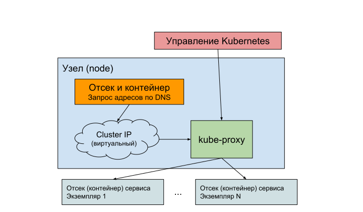

# 7. Взаимодействие сервисов Kubernetes

Одним из впечатляющих преимуществ разработки приложения в виде набора микросервисов является возможность работать над ними индивидуально, используя разные библиотеки, языки, платформы, более того, различный процесс и подход к разработке. Далее микросервисы отдельно масштабируются, обновляются и отлаживаются - все это делает жизнь разработчиков более гибкой, а разработку быстрой. Однако возникает вопрос взаимодействия микросервисов - вместо вызова обычных методов и функций каждое взаимодействие становится сетевым вызовом, как правило, следующим формату HTTP и правилам вызова REST.

Вопрос эффективности сетевых взаимодействий между компонентами одной большой системы довольно обширен. Туда входят протоколы данных, оптимизация и сжатие данных, попытка найти золотую середину между громоздкими данными в форматах JSON/Protobuf, слепляющими несколько логических вызовов в один большой пакет, и нагрузкой на сеть, возникающую при чрезмерно частых и мелких сетевых вызовах. Определить нужные параметры и выбрать оптимальный протокол для своих сервисов и систем сможете только вы сами, но взаимодействие сервисов в мире Kubernetes уже работает для вас без дополнительных усилий.

Основной задачей системы управления кластером является обнаружение сервисов (service discovery). Полагаться на прямое использование обычного IP-адреса нельзя - кластер Kubernetes слишком динамичен, при обновлении версий, ошибках, повышении нагрузки и масштабировании отсеки (pod) с контейнерами останавливаются и удаляются, потом запускаются заново, а их сетевые адреса все время меняются. В Интернете системой обнаружения является сервис поиска имен DNS, сервера которой поддерживают базу данных имен и адресов для них, и позволяют пользователям быстро переходить на нужный IP-адрес по простому имени, даже если адреса постоянно меняются. 

DNS используется и в кластере Kubernetes. Каждому сервису, созданному с помощью объекта Service, присваивается доменное имя, совпадающее с именем самого сервиса. Это доменное имя доступно только внутри самого кластера, на каждом его узле, для любого запущенного там контейнера. Для взаимодействия сервисы находят необходимые им для работы сервисы-партнеры по заранее известному имени в DNS. У каждого сервиса Kubernetes должно быть свое уникальное имя.

Давайте проверим.

## Обнаружение сервисов через DNS

Перед проверкой доступа к микросервису `time-service` удостоверьтесь, что ваш текущий кластер работает и настроен для команды `kubectl`, и созданные нами в прошлых главах развертывание (deployment) и сервис переданы в него командой `kubectl apply`.

Узнать, что доменное имя существует, можно просто выполнив команду `curl|wget time-service:8080`, и удостовериться, что доменное имя найдено, соответствует адресу нашего микросервиса, и правильный ответ получен. Однако выполнить эту команду надо в кластере (то есть запустив ее на одном из его узлов, или из контейнера, или с помощью сессии SSH), как если бы обращались к сервису `time-service` из другого микросервиса, также работающего в нашем кластере. 

Можно было бы написать простой скрипт `shell`, упаковать его в контейнер, запустить на кластере и проверить его журнальные записи (как мы знаем, состоящие из записей стандартного вывода), но это чрезмерно долго и сложно для простой отладки. 

Для проверки параметров сети и имен DNS нам понадобится обычный терминал с самыми распространенными командами Linux, и здесь как нельзя кстати пригодится специальный вариант команды `kubectl run`. Эта команда запускает отсек на одном из узлов кластера из указанного ей образа (image) контейнера. 

Используя ключ `--tty`, мы просим инструмент `kubectl` присоединить к запущенному контейнеру эмулятор терминала, а ключ `-i` (interactive) открывает этот терминал сразу же после запуска контейнера, и в том же сеансе, который используется для самой команды `kubectl`. Остается выбрать образ Linux, который мы запустим - для этих целей как нельзя лучше пригодится самый простой образ `busybox`, основанный на крайне минималистичной версии Linux, применяемой для встраиваемых устройств - размер этого образа не превышает нескольких мегабайт, а ресурсов требует этот контейнер совсем мало! Подобный способ заглянуть внутрь кластера очень часто используется для отладки Kubernetes. Последний аргумент (`-- sh`) исполняет первую команду в контейнере - это будет интерактивная оболочка shell.

```console
$ kubectl run -i --tty busybox --image=busybox -- sh
/ #

```

Запустив наш контейнер `busybox`, мы тут же получим доступ к интерактивному терминалу, работающему внутри нашего кластера. Теперь мы проверим доменной имя своего сервиса (команды `curl` в образе `busybox` нет, зато есть `wget`):

```console
/ # wget time-service:8080/nanotime -O -
Connecting to 10.15.251.13:8080 (10.15.251.13:8080)
{"nanoTime":"1547850153973197546"}

```

Сервис работает, и путь к простому взаимодействию микросервисов в кластере Kubernetes открыт - им необходимо знать лишь имена сервисов-партнеров и открытые ими порты. Необходимости искать и снабжать сервисы точными адресами IP и управлять этими адресами нет.

Теперь мы посмотрим, как именно работает система обнаружения имен DNS внутри нашего кластера Kubernetes. С помощью запущенного контейнера `busybox` нам доступны все системы и все сетевые адреса кластера, и теперь мы можем использовать базовые сетевые команды Linux для проверки наших сервисов в DNS. 

```console
/ # nslookup time-service
Server:   10.15.240.10
Address:  10.15.240.10:53

Name: time-service.default.svc.cluster.local
Address: 10.15.251.13

```

Как мы уже упомянули, каждому сервису, созданному с помощью объекта Service, присваивается доменное имя, совпадающее с именем самого сервиса. Именно это мы видим в выводе команды `nslookup`, передав ей в качестве параметра имя нашего сервиса `time-service` (пока он единственный в нашем кластере). 

Сервис `time-service` доступен не только по простому имени сервиса из объекта Service, но мы видим и более сложное составное имя `time-service.default.svc.cluster.local`. Это общий формат имени сервиса в случае использования дополнительных пространств имен (namespace) в кластере Kubernetes. Мы пока не использовали их и узнаем о них подробнее чуть позже, но по сути это способ разделить кластер на индивидуальные зоны, где возможно использовать одни и те же имена объектов Kubernetes, что-то вроде пакетов в Java или пространств имен в С#. Если вы не указывает пространство имен явно, все сервисы и остальные объекты Kubernetes создаются в пространстве по умолчанию `default`. Если вы захотите вызвать сервис из другого пространства имён, придется указать именно такой формат или чуть короче, просто указав пространство имен через точку:

```
[имя сервиса].[пространство имен = default].[сервис = svc].[общий суффикс для кластера = cluster.local]

[имя сервиса].[пространство имен = default]
```

Суффикс кластера обычно не меняют, для примера в кластере Google Kubernetes Engine это `cluster.local`, но при желании можно поменять и его - как правило это связано с взаимодействием имен из нескольких кластеров одновременно, и встречается не так часто.

Все также используя терминал контейнера `busybox`, проверим, что и расширенные доменные имена с использованием пространств имен и суффиксов работают:

```console
/ # wget time-service.default.svc.cluster.local:8080/nanotime -O -
Connecting to time-service.default.svc.cluster.local:8080 (10.15.251.13:8080)
{"nanoTime":"1547850322608275624"}

/ # wget time-service.default:8080/nanotime -O -
Connecting to time-service.default:8080 (10.97.105.149:8080)
{"nanoTime":"1550678757460527000"}

```

После использования контейнера `busybox` можно выйти из терминала (`exit`), но он останется запущенным. Вы можете или удалить его из кластера (удалив отсек `busybox` с помощью `kubectl delete`), или оставить дальнейших экспериментов. Заново присоединить терминал к нему можно следующей командой:

```console
$ kubectl attach pod/busybox -i -t
```

## Обнаружение сервисов с помощью переменных окружения

При появлении нового сервиса управляющий узел Kubernetes добавляет в каждый работающий в кластере отсек (pod) набор переменных окружения, состоящих из имени сервиса и поддерживаемых им портов. Эти переменные содержат IP-адрес, по которому сервис можно обнаружить, и открытые им порты. Мы можем проверить, что такие переменные будут добавлены и для нашего сервиса `time-service`. Используем запущенный в прошлом разделе контейнер с Linux `busybox` (используя `kubectl attach`) и посмотрим, какие переменные, начинающиеся с имени нашего сервиса, доступны в отсеке:

```console
$ kubectl attach pod/busybox -i -t
…
/ # printenv | grep TIME_SERVICE
TIME_SERVICE_PORT=tcp://10.97.105.149:8080
TIME_SERVICE_SERVICE_PORT=8080
TIME_SERVICE_PORT_8080_TCP=tcp://10.97.105.149:8080
TIME_SERVICE_SERVICE_HOST=10.97.105.149
TIME_SERVICE_PORT_8080_TCP_ADDR=10.97.105.149
TIME_SERVICE_PORT_8080_TCP_PORT=8080
TIME_SERVICE_PORT_8080_TCP_PROTO=tcp

```

Можно использовать эти переменные напрямую из терминала для подключения к сервису:

```console
/ # wget $TIME_SERVICE_SERVICE_HOST:$TIME_SERVICE_SERVICE_PORT/time -O -
Connecting to 10.97.105.149:8080 (10.97.105.149:8080)
{"time":"2022-05-26 22:51:37.750063401 +0000 UTC m=+168.111218195"}
```

В основном используются две переменные окружения - `[ИМЯ СЕРВИСА]_[SERVICE_HOST]` и `[ИМЯ СЕРВИСА]_[SERVICE_PORT]`, определяющие адрес сервиса и его порт, остальные переменные добавляются для совместимости с Docker. По большому счету, использовать переменные окружения не только менее удобно, чем имена DNS, но и не всегда разумно - во первых, переменные окружения добавляются во все отсеки немедленно после появления нового объекта Service, даже если он еще не готов. В конце главы мы узнаем, как определяется готовность сервиса в Kubernetes и реализуем такую проверку готовности для своего нового сервиса. Во-вторых, если отсек уже запущен, новые сервисы и их переменные окружения в него уже не попадут - так что сервисы должны быть созданы до запуска отсеков, если вы намерены использовать переменные окружение. Kubernetes DNS намного более гибкая система.

## Сервисы и метки

Мы увидели, что сервисы Kubernetes позволяют вам найти микросервис или приложение по его имени, получить его сетевой адрес внутри кластера и открыть соединение. Как именно система обнаружения находит наш контейнер (работающий внутри отсека pod)? Используются метки (label), которые мы задаем в объекте Service и затем передаем в управляющую систему Kubernetes. Метки задаются в секции metadata и доступны для любого объекта Kubernetes. Вот что мы указали в прошлом разделе для своего микросервиса `time-servce`:

```yaml
...
metadata:
  labels:
    app: time-service
```

Мы использовали всего одну метку (`app`), и таким образом, все отсеки, имеющие совпадение по этим меткам, будут выбираться для доступа через созданный сервис. Когда мы создавали наше развертывание Deployment, мы указали, что для всех созданных в этом управлении развертываний будет применяться те же самые метки (шаблон для всех создаваемых отсеков с контейнерами - `template.spec`):

```yaml
...
  template:
    metadata:
      labels:
        app: time-service
```

Использование меток позволяет однозначно находить все экземпляры, подходящие для работы с сервисом, независимо от того, в каком количестве они созданы, какие версии контейнеров в них запущены, и как они обновляются и управляются. Для отладки можно воспользоваться ручным поиском отсеков по меткам с помощью ключа `--selector`, указав для него список меток и их значений:

```console
$ kubectl get pods --selector=app=time-service
NAME                            READY   STATUS    RESTARTS   AGE
time-service-77d9656579-xrg52   1/1     Running   0          11d
```

Мы ожидаемо получили единственный экземпляр своего микросервиса (и получим больше, если применим масштабирование) - это единственные отсеки с таким набором меток. Именно этот отсек будет вызываться через систему обнаружения сервисов Kubernetes.

## Основные типы сервисов в Kubernetes

Сервис в Kubernetes - это точка доступа к приложению через сетевой порт. Вариантов такого доступа может быть несколько, и особенно важно в динамической, масштабируемой среде запуска Kubernetes обеспечить поддержку работы с приложением, работающим во множестве экземпляров. В этом случае обратиться напрямую к его IP-адресу и порту будет неправильно - мы просто будем игнорировать остальные экземпляры. В простейшем случае должна быть возможность выбрать один из экземпляров приложения случайным образом или циклически. Поддержка динамических экземпляров в Kubernetes использует особую сетевую архитектуру и три основных вида сервисов (поле `type` в описании объекта Service):

* `ClusterIP`. Это тип сервиса по умолчанию. Сервис будет доступен через IP-адрес в кластере, внутри сети кластера, и не будет доступен снаружи кластера и в Интернете. Остальные микросервисы и части приложения смогут найти этот адрес через обнаружение имен Kubernetes DNS. Доступ к экземплярам (контейнерам) этого микросервиса обеспечивает виртуальный IP-адрес и прокси-компонент kube-proxy, особенности которого мы сейчас рассмотрим. В большинстве случаев микросервисы (как составные части приложения) являются вспомогательными и не должны быть доступны извне - это подходящий для них тип сервиса.
* `NodePort`. Порт на каждом узле кластера. Для сервиса отводится уникальный номер порта (*внимание - он не совпадает с номером порта самого приложения!*). Этот порт открывается на всех узлах кластера. Номер порта выбирается из специально отведенного диапазона. Обычно этот тип сервиса хорош для нестандартной настройки балансировки нагрузки - сделать это через единый номер порта и все узлы кластера проще. Также к этому типу сервиса легче получить доступ для отладки - достаточно сделать переадресацию портов с любого узла кластера или обратиться напрямую к узлу, к которому у вас есть доступ.
* `Load Balancer`. Балансировщик нагрузки, встроенный в кластер. Обычно он доступен только в публичных облаках, таких как Google Cloud или AWS (и недоступен в эмуляторах Docker и minikube). По сути сервис создается с типом NodePort, а затем к нему подключается балансировщик нагрузки от провайдера облака. Обычно это делается для единой внешней точки входа в приложение из Интернета. Обратите внимание, что стоимость такого балансировщика может быть весьма немалой! Мы уже использовали этот тип сервиса в самом начале знакомства с Kubernetes для своих первых тестов.

## Виртуальные IP-адреса. Kube-proxy

Все мы примерно представляем, как работает система доменных имен DNS - на каждое имя тем или иным способом, обычно с помощью записей типа A, возвращается список точных IP-адресов, и по этому адресу находится или сам сервер, или (чаще) точка входа в кластер, обычно это сервер балансировщика нагрузки. В мире Kubernetes сервисы работают внутри отсеков (pods), при создании отсека при масштабировании, обновлениях, новых версиях, всем им присваиваются новые IP-адреса внутри кластера. Это может происходить часто и быстро, и кэш DNS просто не успеет обновить список адресов, по которым надо обратиться. Решение в Kubernetes - виртуальные IP-адреса.

Виртуальные IP-адреса не указывают на конкретный сервер или виртуальный отсек. Вместо этого они служат точкой переадресации на список существующих в данный момент отсеков, соответствующих сервису. Как мы видели, список этих сервисов определяется выбором по меткам. Напрямую обращаться к ним не получится. Для обеспечения их работы в каждом узле (node) кластера Kubernetes работает вспомогательный прокси-компонент kube-proxy. Через этот прокси проходит весь сетевой трафик узла ото всех работающих в нем отсеков (и соответственно, находящихся в них ваших контейнеров с сервисами). 

При обращении к виртуальному IP-адресу kube-proxy находит список соответствующих этому адресу отсеков (по меткам сервиса), и выбирает один из них. Выбор одного из множества отсеков, если сервис работает во множестве экземпляров, зависит от настроек самого кластера - как правило это или случайный порядок, или классический циклический выбор, она же “карусель” (round robin).

На схеме это выглядит примерно так:





Теперь картина создания и работы сервиса становится полной - при создании нового объекта Service в кластере создается новый виртуальный IP-адрес, и прокси-компоненты kube-proxy на всех узлах добавляют его в свои списки адресов. После того, как сервис готов к работе, обращение по этому виртуальному адресу переадресуется к одному из отсеков, которые относятся к сервису (поиск по меткам). При перезапуске отсеков, увеличении и уменьшении их количества при масштабировании, их обновлении, состояние kube-proxy постоянно обновляется, позволяя работающим в кластере сервисам прозрачно работать с виртуальным адресом, совершенно не волнуясь о всех происходящих за его кулисами переменах. Это великолепная возможность реализовать взаимодействие большой группы распределенных сервисов в очень динамичном, постоянно меняющемся состоянии.

## Развертывание нескольких сервисов

Итак, мы поняли, что можем находить сервисы просто по их имени, используя встроенную в Kubernetes поддержку DNS. Мы рассматриваем не только возможности Kubernetes, но больше непосредственно разработку новых облачных сервисов и их работу в кластере. Давайте напишем новый сервис, который будет работать на том же самом кластере, где в предыдущих главах мы уже тестировали и запускали простейший микросервис для определения текущего времени. Код этого сервиса будет обращаться к сервису времени, получать текущее время (представим гипотетически, что отдельный сервис времени позволит нам решить задачу точной синхронизации), и определять, выходной ли сегодня день. Как мы прекрасно помним, в мире много часовых поясов (time zone), в некоторых из них дни разные, поэтому такой сервис должен в качестве параметра знать часовой пояс, для которого определяется выходной день. Возможно, такой сервис нам пригодится позже для создания календаря и других услуг.

Создание второго микросервиса, который должен будет использовать библиотеку с поддержкой часовых поясов и инструменты для работы с календарями и датами, как нельзя лучше поможет нам увидеть, как легко соединить совершенно разные технологии и подходы к разработке в одном кластере Kubernetes. Для определения часового пояса и выходных дней используем Java, точнее встроенный в основной набор библиотек SDK пакет java.time, для взаимодействия в стиле HTTP/REST применим простую и компактную библиотеку Spark, которая будет работать со встроенным сервером Jetty, а работу с форматом JSON организуем с помощью библиотеки Google GSON. Как правило, наиболее распространены сервисы на основе библиотек Spring Boot, но они немного перегружены функциональностью для нашего простого теста.

В результате технологии двух наших сервисов будут отличаться как небо и земля, но как мы увидим, устроить их взаимодействие и развертывание в одном кластере (возможно, даже на одном и том же узле) с мощью Kubernetes будет просто.

Итак, напишем сервис выходного дня:

```java
package com.porty.k8s;

import com.google.gson.Gson;
import org.slf4j.Logger;
import org.slf4j.LoggerFactory;

import java.io.InputStreamReader;
import java.net.URI;
import java.time.DayOfWeek;
import java.time.Instant;
import java.time.ZoneId;
import java.util.EnumSet;
import java.util.concurrent.atomic.AtomicBoolean;

import static spark.Spark.*;

/**
* Простой сервис на основе Spark/Java, запрашивающий время у микросервиса
* time-service и возвращающий результат - выходной ли день в указанной
* временной зоне, и какой именно это выходной.
*/
public class WeekendService {
   private static Logger logger =
           LoggerFactory.getLogger(WeekendService.class);

   public static void main(String[] args) {
       port(5678);

       Gson gson = new Gson();

       // страна и город для выяснения выходного дня кодируется прямо в пути
       // запроса HTTP
       // пример: /weekend/Europe/Moscow
       get("/weekend/:country/:city", (req, res) -> {
           ZoneId timeZoneId =
                   ZoneId.of(req.params("country") + "/" + req.params("city"));
           logger.info("Запрошен статус выходного дня для зоны {}",
                   timeZoneId);

           // запрашиваем время от вспомогательного сервиса и преобразуем
           // его в объект c данными
           TimeServiceResponse timeServiceResponse = gson.fromJson(
                   new InputStreamReader(
                           URI.create("http://time-service:8080/nanotime").
                                        toURL().openStream()),
                   TimeServiceResponse.class);
           // используем пакет java.time для получения данных о текущем дне
           Instant millisTime = Instant.ofEpochMilli(
                   Long.parseLong(timeServiceResponse.getNanoTime()) / 1000000);
           DayOfWeek dayOfWeek = millisTime.atZone(timeZoneId).getDayOfWeek();
           boolean isWeekend = EnumSet.of(DayOfWeek.SATURDAY, DayOfWeek.SUNDAY)
                   .contains(dayOfWeek);

           return new TimeZoneReply(isWeekend, dayOfWeek.name());
       }, gson::toJson);
   }

   // стандартный класс с данными для преобразования результата сервиса в JSON
   static class TimeZoneReply {
       private boolean weekend;
       private String day;

       TimeZoneReply(boolean weekend, String day) {
           this.weekend = weekend;
           this.day = day;
       }

       public boolean isWeekend() {
           return weekend;
       }

       public String getDay() {
           return day;
       }
   }

   // стандартный класс с данными для получения данных JSON от сервиса
   // time-service
   static class TimeServiceResponse {
       private String time;
       private String nanoTime;

       public String getTime() {
           return time;
       }

       public void setTime(String time) {
           this.time = time;
       }

       public String getNanoTime() {
           return nanoTime;
       }

       public void setNanoTime(String nanoTime) {
           this.nanoTime = nanoTime;
       }
   }
}
```

Код краток и достаточно информативен сам по себе - мы импортируем статические методы библиотеки Spark, и задаем редко используемый номер порта методом `port`, чтобы избежать конфликтов и путаницы с широко распространенными номерами портов при тестировании. Основной метод нашего нового сервиса - обработка HTTP-запроса GET по маршруту `/weekend`. Для простоты обращения к сервису необходимые нам параметры для указания часового пояса задаются прямо в маршруте HTTP, а не дополнительными параметрами, так что для того, чтобы выяснить выходной ли день в Москве, нужно будет вызвать адрес `/weekend/Europe/Moscow`.

Для получения времени используется уже созданный и развернутый нами в кластере Kubernetes сервис `time-service`, и заранее известный нам номер порта, по которому к нему можно обратиться. Мы используем класс URL и открываем с его помощью поток данных для чтения InputStream, ну а тот, в свою очередь, преобразуется в объект с данными Java `TimeServiceResponse` с помощью GSON. Для преобразования необходимо совпадения полей и их типов между данными Json и классом Java.

Далее мы преобразуем время с точностью до наносекунд, которое нам предоставляет сервис `time-service`, в миллисекунды, и используя элементарные преобразования библиотеки Java Time, получаем день недели в указанном часовом поясе, легко выводя, выходной ли это день. Далее данные упаковываются в объект `TimeZoneReply` и преобразуются в Json с помощью GSON. Все детали используемых методов и библиотек легко можно найти в их документации в Интернете.

Наконец, чтобы иметь представление, что происходит в уже работающем сервисе, мы применяем распространенную библиотеку для записи журналов (logs) в Java - SLF4J. Без дополнительной настройки журналы будут использовать формат по умолчанию (как правило с указанием времени, имени потока thread, и названия объекта, создавшего запись), что обычно вполне достаточно, и выводить записи в стандартный вывод. Как мы знаем из введения в Kubernetes, это основной способ работы с журналами в контейнерах. Более того, инфраструктура Spark также использует SLF4J для записи журналов.

### Сборка сервиса и образ контейнера

Концепция облачного приложения или его части в виде отдельного микросервиса диктует упаковку в контейнер, что мы и сделаем с помощью уже хорошо нам знакомого инструмента Docker и его декларации для описания образа контейнера Dockerfile. Для начала используем стандартный для Java способ сборки проекта и описания его зависимостей и библиотек с помощью инструмента Gradle (можно использовать и Maven, но для таких небольших проектов описание сборки проекта с помощью Gradle чуть более кратко и выразительно, чем используемый в Maven XML):

```
plugins {
   id 'java'
}

group 'com.porty.k8s'
version '0.1.0-SNAPSHOT'

sourceCompatibility = 1.8

repositories {
   mavenCentral()
}

dependencies {
   compile "com.sparkjava:spark-core:2.7.2"
   compile "org.slf4j:slf4j-simple:1.7+"
   compile "com.google.code.gson:gson:2.8+"
}

// особый способ упаковки сервиса java в контейнер - 
// все библиотеки складываем в "толстый архив" (fat JAR)
jar {
   manifest { attributes "Main-Class": "com.porty.k8s.WeekendService" }
   from {
       configurations.compile.collect { it.isDirectory() ? it : zipTree(it) }
   }
}
```

Файл сборки объявляет название и версию проекта (для первой версии, согласно популярному способу семантического версионирования `semver.org`, обычно используют 0.1.0), зависимости от библиотек Spark, GSON и журналирования SLF4J, и самое интересное, собирает все необходимые зависимости в “толстый” архив JAR, и объявляет его класс с методом `main()`. Это распространенная практика для упрощения создания контейнера для программ Java, чтобы уменьшить копирование обычно немаленького количества требуемых для работы дополнительных библиотек JAR. Экосистема Spring Boot поддерживает единый архив, но немного тяжеловата для такого микроскопического сервиса. Собрать наш сервис в “толстый” архив теперь элементарно:

```console
$ ./gradlew build
```
В результате мы получим архив со всеми зависимостями в директории проекта `build\libs`.

Создадим образ контейнера, применив технику многоступенчатой сборки, рассмотренную нами в разделе о сборке образов image:

```Dockerfile
# Первая ступень на основе стандартного образа Gradle (версия 6.9)
FROM gradle:6.9-jdk11 as builder

# Директория для файлов проекта
WORKDIR weekend-service/

# Копируем файл сборки и исходный код
COPY build.gradle ./
COPY src/ ./src/

# Сборка
RUN gradle build

# Вторая ступень для окончательной сборки
# Минимальная версия JRE, версия 11, открытая версия OpenJDK
FROM openjdk:11-jre-slim

# Такая же директория
WORKDIR weekend-service/
# Скопируем архив JAR из первой ступени
COPY --from=builder home/gradle/weekend-service/build/libs/weekend-service-0.1.0-SNAPSHOT.jar .
 
# Объявим свой порт
EXPOSE 5678

CMD ["java", "-jar", "/weekend-service/weekend-service-0.1.0-SNAPSHOT.jar"]

```

Детали сборки нашего образа указаны в комментариях в файле `Dockerfile`, и нам уже хорошо знакомы. Для получения чистой сборки мы собираем приложение полностью заново внутри процесса сборки самого образа контейнера. Первая ступень основана на стандартном образе Gradle и JDK 11. Заметьте, версия Gradle *зафиксирована* - мы используем 6.9. Это очень интересный пример предотвращения возможных ошибок - если бы выбрали образ `latest` без версии Gradle, мы автоматически перешли бы в какой-то момент на новую версию Gradle 7, в которой некоторые конструкции прежнего Gradle 6 перестали поддерживаться, и сломали бы нашу сборку. Автоматическое обновление версий требует постоянной поддержки!

Мы копируем только файл сборки и исходный код, и тем самым гарантируем новую сборку, не зависящую от состояния библиотек и зависимостей на локальной машине. Полученный архив копируется во вторую ступень, оптимизированную версию (`slim`) JRE версии 11 (на момент написания версии Java 11 для Linux Alpine еще не было, обычно это самый компактный по размеру вариант). При запуске контейнера мы просто вызовем свой метод основной класс и его метод `main()`, записанный в манифесте архива JAR. 

Если ваш файл сборки и исходный текст не меняется, то сборка образа будет медленной только в первый раз - в последующие разы сработает кэш. Но, без сомнения, в коде будет много изменений, и для написанного нами `Dockerfile` это означает скачивание всех зависимостей из репозитория Maven Central вновь и вновь при каждой сборке, и только потом идет компиляция кода - это будет занимать немалое время при каждой попытке собрать обновленное приложение. 

Существуют решения, ускоряющие этот процесс, например, хранить зависимости приложения так, чтобы они кэшировались отдельно от кода (отдельный слой layer в образе). Лучше всего поможет нам инструмент Jib, созданный в компании Google. Мы его уже кратко упоминали, рассматривая альтернативные методы сборки образов. Чтобы избежать неэффективной и медленной сборки Java-приложений с постоянным скачиванием зависимостей из Интернета, Jib будет использовать локальный кэш Gradle или Maven, и значительно оптимизирует процесс.

Для работы с Jib нужно лишь добавить один плагин:

```
plugins {
    id 'com.google.cloud.tools.jib' version '3.2.1'
}
```

Построим образ, используя все ту же версию 0.1.0 в качестве метки, и после этого отправим его в центральный репозиторий Docker Hub, чтобы образ стал доступен для удаленных кластеров (как мы помним, это необязательно при использовании локального кластера, такого как minikube или Docker, но для minikube надо дополнительно загрузить образ):

```console
$ docker build . -t {ваша_учетная_запись_Docker}/weekend-service:0.1.0
…
$ docker push {ваша_учетная_запись_Docker}/weekend-service:0.1.0
```

Если вы используете Jib, то построить и отправить образ в репозиторий позволяет следующая простая команда. Повторные сборки образа при изменениях в коде будут в разы быстрее, а размер образа при этом значительно уменьшится, даже по сравнению с нашей двухступенчатой сборкой это будет выигрыш около 50%!
 
```console
$ ./gradlew jib --image={ваша_учетная_запись_Docker}/weekend-service:0.1.0
```

### Локальная проверка

Прежде чем погрузиться в создание развертывания Deployment и сервиса Service для кластера Kubernetes, всегда будет отличной мыслью проверить полученный образ контейнера на работоспособность, запустив его на своей локальной машине с помощью того же инструмента Docker и команды `run`:

```console
$ docker run -p 5678:5678 {ваша_учетная_запись_Docker}/weekend-service:0.1.0

[Thread-0] INFO org.eclipse.jetty.util.log - Logging initialized @233ms to org.eclipse.jetty.util.log.Slf4jLog
[Thread-0] INFO spark.embeddedserver.jetty.EmbeddedJettyServer - == Spark has ignited ...
[Thread-0] INFO spark.embeddedserver.jetty.EmbeddedJettyServer - >> Listening on 0.0.0.0:5678
[Thread-0] INFO org.eclipse.jetty.server.Server - jetty-9.4.z-SNAPSHOT, build timestamp: 2017-11-21T21:27:37Z, git hash: 82b8fb23f757335bb3329d540ce37a2a2615f0a8
[Thread-0] INFO org.eclipse.jetty.server.session - DefaultSessionIdManager workerName=node0
[Thread-0] INFO org.eclipse.jetty.server.session - No SessionScavenger set, using defaults
[Thread-0] INFO org.eclipse.jetty.server.session - Scavenging every 660000ms
[Thread-0] INFO org.eclipse.jetty.server.AbstractConnector - Started ServerConnector@1f813481{HTTP/1.1,[http/1.1]}{0.0.0.0:5678}
[Thread-0] INFO org.eclipse.jetty.server.Server - Started @347ms

```

Запустив контейнер с помощью команды `docker run`, необходимо не забыть перенаправить порт контейнера, который обслуживает веб-сервер, на порт нашей локальной машины, после чего мы увидим процесс запуска веб-сервера библиотеки Spark с помощью журнальных записей в стандартном выводе на консоль. Там же мы увидим, по какому адресу можно найти этот сервер `Started ServerConnector@1f813481 {HTTP/1.1,[http/1.1]} {0.0.0.0:5678}`. Попробуем получить ответ сервера (в новом терминале, так как в текущем будет работать наш контейнер и будут выводиться его журналы logs):

```console
$ curl 0.0.0.0:5678
<html><body><h2>404 Not found</h2></body></html>
```

Ответ ожидаемый, и приятно видеть что используемая нами инфраструктура Spark позаботилась о форматировании и правильном коде ответа HTTP - в нашем сервисе запрос к корневому адресу `/` не обслуживается. Подтверждение запроса мы увидим в журнале сервиса:

```
[qtp1759478938-18] INFO spark.http.matching.MatcherFilter - The requested route [/] has not been mapped in Spark for Accept: [*/*]
```

Попробуем теперь получить день недели, и узнать, выходной ли это, для часового пояса Москвы, в стандартном описании часового пояса:

```console
$ curl 0.0.0.0:5678/weekend/Europe/Moscow
<html><body><h2>500 Internal Server Error</h2></body></html>
```
На этот раз ответ не столь приятен - внутренняя ошибка сервера. В идеальном сервисе мы бы позаботились о детальном ответе в формате JSON, но для прототипа и просто примера этого вполне достаточно. Вновь посмотрев на стандартный вывод нашего контейнера с сервисом, мы ожидаемо увидим причину ошибки - требуемый для работы сервис `time-service` не доступен через адрес DNS и свой порт (`UnknownHostException`):

```
[qtp1759478938-19] INFO com.porty.k8s.WeekendService - Запрошен статус выходного дня для зоны Europe/Moscow
[qtp1759478938-19] ERROR spark.http.matching.GeneralError - 
java.net.UnknownHostException: time-service
  at java.net.AbstractPlainSocketImpl.connect(AbstractPlainSocketImpl.java:184)
  at java.net.SocksSocketImpl.connect(SocksSocketImpl.java:392)
  at java.net.Socket.connect(Socket.java:589)
  at java.net.Socket.connect(Socket.java:538)
  at sun.net.NetworkClient.doConnect(NetworkClient.java:180)
  at sun.net.www.http.HttpClient.openServer(HttpClient.java:463)
           ...
```

Чтобы получить доступ к дополнительным микросервисам через DNS, нам уже не обойтись простым запуском второго контейнера `time-service`. Чуть позже мы обсудим, какие подходы существуют в тестировании микросервисов на локальной машине без запуска новых сервисов, развертываний, и кластеров. Сейчас давайте запустим свой сервис на кластере Kubernetes.

### Создание объектов Kubernetes и развертывание сервиса

Вновь применяя уже знакомый нам по предыдущей главе подход `kubectl --dry-run` для получения шаблонов YAML для объектов Kubernetes, создадим заготовки с описанием объекта Deployment для развертывания Kubernetes, и поменяем имя образа и его версию:

```yaml
apiVersion: apps/v1
kind: Deployment
metadata:
 labels:
   app: weekend-service
 name: weekend-service
spec:
 selector:
   matchLabels:
     app: weekend-service
 template:
   metadata:
     labels:
       app: weekend-service
   spec:
     containers:
       - image: ivanporty/weekend-service:0.1.0
         name: weekend-service

```

Мы применили практически идентичный с нашим первым микросервисом для получения времени подход, используя метку (label) `app` с именем сервиса, и указав образ контейнера и его версию в секции `template`, которая и будет определять, какие контейнеры будут запускаться при создании новых отсеков развертывания.

Практически аналогичным будет и объект сервиса Service:

```yaml
apiVersion: v1
kind: Service
metadata:
 labels:
   app: weekend-service
 name: weekend-service
spec:
 ports:
   - port: 5678
 selector:
   app: weekend-service
 type: NodePort

```

Нам остается удостовериться, что сервис выбирает правильные отсеки по меткам label, указать открытый порт, и сделать этот порт доступным на всех отсеках кластера, используя тип сервиса `NodePort`.

Файлы с описанием объектов развертывания и сервиса мы разместили в папке `k8s`, и теперь вновь можем применить практически магическую команду `apply`, чтобы привести состояние своего кластера в соответствие с состоянием объекта в наших описания YAML:

```console
$ kubectl apply -f k8s/
deployment.apps/weekend-service created
service/weekend-service created
```

При первом запуске развертывание и сервис будут созданы, а при последующим запусках уже модифицированы (при необходимости конечно), и все детали и разницу в состояниях возьмет на себя управляющий узел Kubernetes. Мы уже должны иметь работающий сервис получения времени на своем кластере из предыдущих тестов (если нет, разверните микросервис `time-service` снова), и проверив состояние кластера, мы увидим, что в нем развернуты и доступны наши два сервиса:

```console
$ kubectl get deploy
NAME  ...
time-service         ...
weekend-service    …

$ kubectl get service
NAME       ...
time-service      NodePort    ...       8080:31250/TCP   
weekend-service   NodePort  ...        5678:31056/TCP

```

Остается проверить, что сервис и развертывание работают, и на этот раз вспомогательный микросервис доступен с помощью встроенной в Kubernetes системы DNS. Напрямую получить доступ к сервису, если это не локальный кластер Docker и Minikube, у нас не  получится, но как мы знаем из первых опытов с Kubernetes, мы всегда сможем использовать услугу переадресации порта `port-forward` инструмента `kubectl`, запустив и оставив ее работать в отдельном терминале. Дальше мы сможем запросить свой новый сервис и узнать о дне в запрошенном часовом поясе:

```console
$ kubectl port-forward deploy/weekend-service 5678
Forwarding from 127.0.0.1:5678 -> 5678
Forwarding from [::1]:5678 -> 5678
…

$ curl 0.0.0.0:5678/weekend/Europe/Moscow
{"weekend":false,"day":"FRIDAY"}
$ curl 0.0.0.0:5678/weekend/Asia/Tokyo
{"weekend":true,"day":"SATURDAY"}

```
Как мы видим, теперь наш новый сервис работает, и запрашивает вспомогательный микросервис для получения текущего времени, а затем преобразует его во время переданного ему часового пояса, возвращая ответ в формате JSON. К сожалению, в момент теста выходной день в Москве еще не настал, но это была пятница - тоже неплохо. Зато к этому моменту уже настала суббота в Токио - наш сервис подтверждает, что дни календаря относительны.

Запросив журнал (log) для развертывания, мы увидим записи успешно работающего веб-сервера и обработку запросов:

```console
$ kubectl logs deploy/weekend-service
…
[Thread-0] INFO org.eclipse.jetty.server.AbstractConnector - Started ServerConnector@2a2cb2dc{HTTP/1.1,[http/1.1]}{0.0.0.0:5678}
[Thread-0] INFO org.eclipse.jetty.server.Server - Started @756ms
…
[qtp1759478938-19] INFO com.porty.k8s.WeekendService - Запрошен статус выходного дня для зоны Europe/Moscow
[qtp1759478938-19] INFO com.porty.k8s.WeekendService - Запрошен статус выходного дня для зоны Asia/Tokyo

```


## Локальное тестирование взаимодействующих сервисов

Запустив свой второй микросервис, взаимодействующий с помощью сетевых вызовов с сервисом получения времени `time-service`, мы столкнулись с проблемой локального запуска распределенной многокомпонентной системы. Проверить даже простейшую функциональность на локальной машине без запуска всех необходимых компонентов кажется невозможным. Более того, требуются и услуги Kubernetes, в нашем случае обнаружение сервисов через DNS. Мы запустили все сервисы на своем кластере Kubernetes, и, к счастью, они заработали, но что если возникла проблема, требующая отладки? Мало что сравнится с легкостью и эффективностью отладки в редакторе IDE, где можно проверить все состояние программы в удобной точке ее исполнения.

Существует несколько вариантов решения проблемы отладки микросервисов, работающих в кластере Kubernetes. Вот основные из них:

### Локальный запуск взаимодействующих сервисов Docker Compose 

Один вариант - запуск всех микросервисов внутри виртуальной машины Docker, и организация их взаимодействия с помощью собственного оркестратора Docker (Compose). Есть множество минусов - необходимо поддерживать дополнительную конфигурацию Compose, недоступны сервисы Kubernetes, нельзя проверить их манифесты YAML. Также нет доступа к услугам, библиотекам и функциям API облака, в котором работает приложение. Запустить большие контейнеры не позволит нехватка ресурсов.

### Использование локального эмулятора `minikube`. 

Несомненный плюс - идентичная настоящему кластеру конфигурация Kubernetes,  однако остальные минусы остаются - лишь один узел (node), возможный недостаток вычислительных ресурсов на вашей локальной машине, и опять недоступные дополнительные облачные сервисы и базы данных. Таким образом, больше чем несколько небольших микросервисов на обычной машине для разработки запустить не получится, но проверить все детали манифестов Kubernetes вполне можно.

### Перенаправление сетевого трафика 

Трафик направляется от локального контейнера в кластер Kubernetes и обратно. Эту возможность предоставляет отличный инструмент Telepresence (telepresence.io). Тонкая работа с настройками сети и прокси-компоненты на обеих сторонах (вашей локальной машине в кластере) создают иллюзию работы локального контейнера в удаленном кластере Kubernetes. У вас должно быть достаточно прав доступа к кластеру Kubernetes, чтобы установить дополнительные компоненты, и затем вы сможете не только запустить микросервис локально, не теряя доступа к удаленным сервисам-партнерам, но и отладить ваш код обычным образом из вашего редактора, как если бы все сервисы были доступны на вашей машине. Очень мощный инструмент, заслуженно ставший популярным и часто представленный на конференциях и в статьях. Детали настройки довольно обширны, вы найдете все необходимое на сайте Telepresence.

#### Удаленная отладка микросервиса

Микросервис уже развернут в кластере Kubernetes, как правило, это отдельный кластер, предназначенный для тестирования (QA) или отработки новых изменений (staging). Практически все языки передают состояние для режима отладки через сетевой порт, используя собственный протокол. Для Java к примеру, это будет протокол JDWP (Java debug wire protocol). Зная, как работает сервис Kubernetes, нетрудно понять, что понадобится создать версию сервиса для отладки, открыв в этом сервисе порт, через который будет передаваться отладочная информация. Конечно же, потребуется и отдельный вариант образа для контейнера микросервиса, в котором он будет запущен в режиме отладки (обычно это несколько ключей командной строки или специальный режим сборки). Стандартно для JDWP используется порт 5005 и JVM запускается с такими флагами:

```
-agentlib:jdwp=transport=dt_socket,server=y,suspend=n,address=*:5005
```

Эти флаги надо будет указать в точке запуска контейнера (Dockerfile `CMD`). После развертывания ваш нужно перенаправить порт (5005) на свою локальную машину (`kubectl port-forward …`). Затем ваша среда разработки присоединяется к удаленному процессу (это с легкостью сделают IntelliJ и VS Code) и вы сможете наконец отлаживать свой код, работающий в удаленном кластере.

Приготовления для того, чтобы просто поставить точку останова в программе, немаленькие, и есть множество решений, автоматизирующие подобную отладку, от создания специального образа до модификации сервиса, например Skaffold или Google Cloud Code. Некоторые другие инструменты можно так же найти на сайте книги www.ipsoftware.ru.

### Работа с кодом непосредственно в кластере

Радикальный вариант - разработка кода прямо в кластере. Обычно это копия производственного кластера для экспериментов (development/qa cluster). Используйте VS Code Remote SSH, GitPod для Kubernetes, IntelliJ SSH (или Gateway), чтобы настроить и подключить свою среду разработки к удаленному контейнеру, запущенному в кластере Kubernetes. В нем вы скачиваете код (`git pull`), и запускаете микросервис и тесты непосредственно в том окружении, где ему нужно будет работать. Здесь уже нет проблем с доступом к облачному окружению, другим сервисам, удаленной отладке. Но есть свои минусы - нужен мощный кластер для разработки, хороший Интернет для разработчиков, невозможно вести разработку в случае сбоев сети. Однако в общем подход очень перспективный. Многие глобальные корпорации переходят на данный способ разработки. Такой подход также гораздо безопасней - кража кода и интеллектуальной собственности с машин и ноутбуков разработчиков становится почти невозможной.

## Проверка готовности сервиса к работе

Мы постоянно упоминаем о том, что кластер Kubernetes и работающие в нем контейнеры (в отсеках) с модулями и микросервисами приложения - очень динамичная система. Обновления, перезапуск остановившихся контейнеров, новые версии модулей все время меняют состояние приложения. Обращение по виртуальному IP-адресу может привести нас к совершенно разным экземплярам и даже версиям сервисов, и состояние сервиса может быть еще не готовым, если он был только что запущен.

В подобных распределенных системах хорошей проверенной практикой считается поддержка каждым сервисом сигнала его готовности к работе (readiness check). Как правило, готовность сервиса к работе может значительно отличаться от момента непосредственного запуска его процесса. В примере с нашим микросервисом выходного дня это особенно легко будет увидеть, случись нам использовать его под нагрузкой и в процессе непрерывного обновления - это приложение Java, которое, как хорошо известно, требует некоторого времени для выделения памяти, загрузки классов, и “прогрева” виртуальной машины. Все эти мгновения процесс уже будет запущен, однако сервис будет недоступен. Это может привести к значительному замедлению распределенной системы из множества сервисов, и к возможному сбою многоступенчатой операции.

Если же мы реализуем хороший сигнал готовности к работе, наш контейнер (и его отсек) никогда не будут вызываться через сервисы Kubernetes и их виртуальные IP-адреса, до тех пор пока сигнал не станет положительным. После этого экземпляр сервиса становится доступен.

Kubernetes поддерживает несколько стандартных сигналов готовности сервиса - самый распространенный и как правило удобный - обращение по определенному маршруту по протоколу HTTP. Описание проверки готовности к работе добавляется к объекту развертывания Deployment, в под-объект `template/spec/containers` - в этом есть смысл, ведь именно описание шаблона для всех будущих контейнеров (template) определяет, как они будут создаваться, а объект Deployment управляет набором отсеков с контейнерами приложения или его модуля/сервиса.

Давайте добавим проверку готовности в развертывание сервиса, только что нами созданного:

```yaml
apiVersion: apps/v1
kind: Deployment
metadata:
 labels:
   app: weekend-service
 name: weekend-service
spec:
 selector:
   matchLabels:
     app: weekend-service
 template:
   metadata:
     labels:
       app: weekend-service
   spec:
     containers:
       name: weekend-service
      # секция проверки готовности
       - readinessProbe:
            # проверка готовности с помощью запроса HTTP
            httpGet:
              path: /ready
              port: 5678
            periodSeconds: 2
            initialDelaySeconds: 5
            failureThreshold: 1
            successThreshold: 1
       - image: ivanporty/weekend-service:0.2.0

```

Итак, проверка готовности описана в разделе `readinessProbe`. Сразу же идет тип проверки - у нас это будет запрос по адресу (`/ready`) и порту HTTP (`httpGet`). Можно отрегулировать проверку параметрами:

* `periodSeconds`. Время в секундах между проведением очередной проверки. Проверка проводится регулярно и постоянно, чтобы быстро выявить не готовые контейнеры.
* `initialDelaySeconds`. Задержка перед первым вызовом проверки, если мы точно знаем что сервис сразу готов не будет. Это полезно в нашем случае с Java.
* `failureThreshold` и `successThreshold`. Количество попыток для объявления сервиса не готовым, и наоборот, готовым. Мы поставили везде 1 - одной удачной или неудачной попытки хватит для смены состояния сервиса. Можно менять эти параметры в зависимости от природы вашего микросервиса.

Проверка готовности будет определяться возвращаемыми кодами HTTP - успешные коды (от 200 и меньше 400) будут означать готовность сервиса к работе, любые другие - неготовность.

Обратите также внимание на то, что мы увеличили номер версии в своей декларации развертывания YAML - теперь это версия 0.2.0. Как мы помним, одним из основных столпов концепции приложений, разрабатываемых для облака (cloud native), является их неизменяемость. Мы уже создали версию 0.1.0, упаковали ее в контейнер, и, самое важное, отправили эту версию на централизованный репозиторий. После этого контейнер развернули в кластере. Теперь мы можем быть уверены в том, что образ контейнера версии 0.1.0 всегда будет содержать в себе именно эту функциональность и зависимости, вне зависимости от того, какие изменения мы произвели после этого, и сколько времени прошло после выпуска первой версии. Именно это позволяет нам точно воспроизводить состояние системы и возможность всегда запустить ее, не опасаясь никаких потерь в процессе ее эволюции. Любые последующие изменения должны быть упакованы в новые образы с новыми версиями.

Однако это теория, а на практике нам остается включить поддержку нового маршрута (`/ready`) в свой сервис и реализовать логику, которая определит точный момент готовности сервиса к обработке запросов. На наше счастье, в библиотеке Spark есть для этого простой метод. Вот что у нас получится:

```java
...
private static AtomicBoolean ready = new AtomicBoolean(false);

public static void main(String[] args) {
   port(5678);

  …

       // поддержка сигнала о готовности сервиса к работе. Используем
       // встроенный в библиотеку Spark
       // метод для ожидания готовности сервера к работе, ожидая его в
       // отдельном потоке Thread.
       get("/ready", (req, res) -> {
           if (ready.get()) {
               logger.info("Запрос проверки готовности, сервер готов.");
               return "Готов!";
           } else {
               logger.warn("Запрос проверки готовности, сервер не готов.");
               throw new IllegalStateException("Не готов!");
           }
       });
       // ожидаем готовности в параллельном потоке.
       new Thread(() -> {
           awaitInitialization();
           ready.set(true);
       }).start();

```

Мы добавили новый маршрут  (`/ready`) и сделали его зависимым от значения флага `ready`, который будет выставлен в отдельном потоке, как только синхронный метод `awaitInitialization()` вернет потоку управление, что и будет означать готовность встроенного сервера Spark к приему запросов. В противном случае мы выбросим исключение, что автоматически приведет к ответу с кодом HTTP 500 (Internal Error). Система проверки готовности Kubernetes в этом случае выведет наш контейнер из списка готовых к приему запросов. 

Повторим наш цикл разработки - построим новую версию образа со своим микросервисом, отправим ее в центральный репозиторий образов, запросим обновление состояния кластера Kubernetes с помощью команды `apply`:

```console
$ docker build . -t {ваша_учетная_запись_Docker}/weekend-service:0.2.0
…
$ docker push {ваша_учетная_запись_Docker}/weekend-service:0.2.0
…
$ kubectl apply -f k8s/
deployment.apps "weekend-service" configured
service "weekend-service" unchanged

```

Проверить готовность можно и вручную, перенаправив порт (5678) и запросив точку готовности (как работает и запрашивается точка готовности, можно посмотреть и в журналах):

```console
$ kubectl port-forward deploy/weekend-service 5678
.. в отдельном терминале
$ curl localhost:5678/ready
Готов!

$ kubectl logs deploy/weekend-service
[qtp1698584368-14] INFO com.porty.k8s.WeekendService - Запрос проверки готовности, сервер готов.
```

Чем больше будет в вашей распределенной системе модулей и микросервисов, чем чаще они будут обновляться и масштабироваться, тем более жизненно необходимой будет качественная проверка готовности сервиса к работе. Еще одна проверка в Kubernetes - проверка жизнеспособности (liveness) контейнера, отличается тем, что проверяется возможность контейнера продолжать работу в принципе, или же необходимость его полностью перезапустить. Мы узнаем о ней в подробном описании развертываний (deployment).
 
## Резюме

* Сервисы в Kubernetes предоставляют доступ к экземплярам вашего работающего в кластере микросервиса или приложения через сетевой порт. Найти адрес сервиса удобнее всего через обнаружение имен DNS.
* Сервис Kubernetes использует специальные настройки внутренней сети кластера, прокси-компонент kube-proxy, и виртуальные IP-адреса, чтобы обеспечить прозрачный доступ к динамичному, имеющему склонность к постоянным обновления и перезапускам развертыванию Deployment.
* Внутренняя реализация сервисов позволяет прозрачно работать с любым количеством экземпляров ваших микросервисов и включает в себя простые алгоритмы балансировки нагрузки. Для поиска экземпляров используются метки labels.
* Кроме обычного адреса внутри кластера, вы также можете выбрать тип сервиса NodePort для собственного алгоритма балансировки нагрузки, или использовать встроенный балансировщик облачного кластера с помощью типа LoadBalancer.
* Апробированной и рекомендованной практикой распределенных динамических систем является проверка готовности (readiness check) каждого работающего в кластере сервиса. Kubernetes предоставляет нам встроенную проверку готовности нескольких видов.


